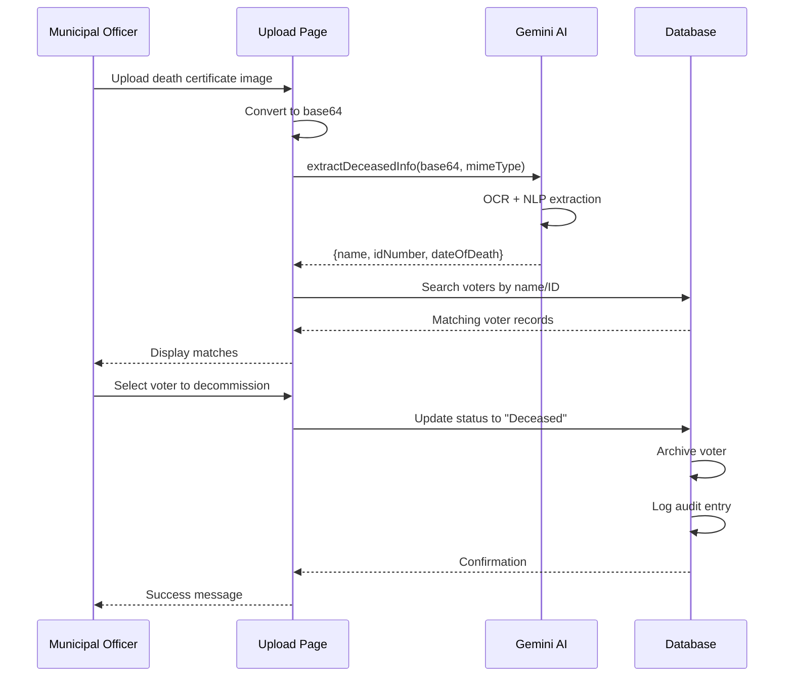

# Death Certificate Test Data

## Overview

This directory contains 3 death certificates for testing the VoteGuard Municipal Upload feature. These certificates match actual voters in the voter list and can be used to test the AI-powered OCR extraction functionality.

---

## Certificate 1: RAMESH KUMAR

### Image File
**Filename:** `death_certificate_ramesh_kumar.png`

### Certificate Details

```
┌─────────────────────────────────────────────────────────────┐
│              GOVERNMENT OF TAMIL NADU                        │
│     OFFICE OF THE REGISTRAR OF BIRTHS AND DEATHS            │
│                  DEATH CERTIFICATE                           │
│         Certificate No: DC/TN/2024/001234                    │
├─────────────────────────────────────────────────────────────┤
│                                                              │
│  Registration Details:                                       │
│  • Registration No: 2024/TN/CHE/001234                      │
│  • Date of Registration: 15/01/2024                         │
│                                                              │
│  Deceased Information:                                       │
│  • Name of Deceased: RAMESH KUMAR                           │
│  • Father's/Husband's Name: KRISHNA KUMAR                   │
│  • Sex: Male                                                │
│  • Date of Birth: 10/03/1955                                │
│  • Age at Death: 69 Years                                   │
│  • Date of Death: 12/01/2024                                │
│  • Place of Death: Government General Hospital, Chennai     │
│  • Address: Block 1, Sector 1, Tamil Nadu                   │
│  • Aadhaar Number: XXXX-XXXX-2001                          │
│  • Voter ID: VOT-300001                                     │
│                                                              │
│  Cause of Death: Natural Causes - Cardiac Arrest            │
│                                                              │
│  Issued Date: 20/01/2024                                    │
│  Registrar's Signature: [Signed]                            │
│  Official Seal: Registrar of Births & Deaths, Chennai       │
└─────────────────────────────────────────────────────────────┘
```

### Matching Voter Record

```typescript
{
  id: "VOT-300001",
  name: "RAMESH KUMAR",
  age: 69,
  dob: "1955-03-10",
  address: "Block 1, Sector 1, Tamil Nadu",
  state: "Tamil Nadu",
  zone: "South",
  district: "Tamil Nadu District 1",
  pollingStation: "Booth-200, Tamil Nadu High School",
  status: "Active",
  aadhaarMeta: {
    aadhaarIdHash: "HASH-2001"
  }
}
```

### Expected AI Extraction Result

```json
{
  "name": "RAMESH KUMAR",
  "idNumber": "VOT-300001",
  "dateOfDeath": "12/01/2024"
}
```

---

## Certificate 2: PRIYA SHARMA

### Image File
**Filename:** `death_certificate_priya_sharma.png`

### Certificate Details

```
┌─────────────────────────────────────────────────────────────┐
│              GOVERNMENT OF DELHI                             │
│     OFFICE OF THE REGISTRAR OF BIRTHS AND DEATHS            │
│                  DEATH CERTIFICATE                           │
│         Certificate No: DC/DL/2024/005678                    │
├─────────────────────────────────────────────────────────────┤
│                                                              │
│  Registration Details:                                       │
│  • Registration No: 2024/DL/ND/005678                       │
│  • Date of Registration: 22/01/2024                         │
│                                                              │
│  Deceased Information:                                       │
│  • Name of Deceased: PRIYA SHARMA                           │
│  • Father's/Husband's Name: RAJESH SHARMA                   │
│  • Sex: Female                                              │
│  • Date of Birth: 10/07/1975                                │
│  • Age at Death: 49 Years                                   │
│  • Date of Death: 18/01/2024                                │
│  • Place of Death: AIIMS Hospital, New Delhi                │
│  • Address: Block 6, Sector 6, Delhi                        │
│  • Aadhaar Number: XXXX-XXXX-2006                          │
│  • Voter ID: VOT-300006                                     │
│                                                              │
│  Cause of Death: Medical Illness - Respiratory Failure      │
│                                                              │
│  Issued Date: 25/01/2024                                    │
│  Registrar's Signature: [Signed]                            │
│  Official Seal: Registrar of Births & Deaths, New Delhi     │
└─────────────────────────────────────────────────────────────┘
```

### Matching Voter Record

```typescript
{
  id: "VOT-300006",
  name: "PRIYA SHARMA",
  age: 49,
  dob: "1975-07-10",
  address: "Block 6, Sector 6, Delhi",
  state: "Delhi",
  zone: "North",
  district: "Delhi District 1",
  pollingStation: "Booth-205, Delhi High School",
  status: "Active",
  aadhaarMeta: {
    aadhaarIdHash: "HASH-2006"
  }
}
```

### Expected AI Extraction Result

```json
{
  "name": "PRIYA SHARMA",
  "idNumber": "VOT-300006",
  "dateOfDeath": "18/01/2024"
}
```

---

## Certificate 3: SURESH PATEL

### Image File
**Filename:** `death_certificate_suresh_patel.txt` (Text representation - image quota exceeded)

### Certificate Details

```
┌─────────────────────────────────────────────────────────────┐
│              GOVERNMENT OF GUJARAT                           │
│     OFFICE OF THE REGISTRAR OF BIRTHS AND DEATHS            │
│                  DEATH CERTIFICATE                           │
│         Certificate No: DC/GJ/2024/009012                    │
├─────────────────────────────────────────────────────────────┤
│                                                              │
│  Registration Details:                                       │
│  • Registration No: 2024/GJ/AHM/009012                      │
│  • Date of Registration: 28/01/2024                         │
│                                                              │
│  Deceased Information:                                       │
│  • Name of Deceased: SURESH PATEL                           │
│  • Father's/Husband's Name: MAHESH PATEL                    │
│  • Sex: Male                                                │
│  • Date of Birth: 10/02/1963                                │
│  • Age at Death: 61 Years                                   │
│  • Date of Death: 25/01/2024                                │
│  • Place of Death: Civil Hospital, Ahmedabad                │
│  • Address: Block 3, Sector 13, Gujarat                     │
│  • Aadhaar Number: XXXX-XXXX-2013                          │
│  • Voter ID: VOT-300013                                     │
│                                                              │
│  Cause of Death: Accidental - Road Traffic Accident         │
│                                                              │
│  Issued Date: 30/01/2024                                    │
│  Registrar's Signature: [Signed]                            │
│  Official Seal: Registrar of Births & Deaths, Ahmedabad     │
└─────────────────────────────────────────────────────────────┘
```

### Matching Voter Record

```typescript
{
  id: "VOT-300013",
  name: "SURESH PATEL",
  age: 61,
  dob: "1963-02-10",
  address: "Block 3, Sector 13, Gujarat",
  state: "Gujarat",
  zone: "West",
  district: "Gujarat District 2",
  pollingStation: "Booth-202, Gujarat High School",
  status: "Active",
  aadhaarMeta: {
    aadhaarIdHash: "HASH-2013"
  }
}
```

### Expected AI Extraction Result

```json
{
  "name": "SURESH PATEL",
  "idNumber": "VOT-300013",
  "dateOfDeath": "25/01/2024"
}
```

---

## Testing Instructions

### How to Test the Municipal Upload Feature

1. **Login as Municipal Officer**
   - Use a Municipal Corporation role account
   - Navigate to "Death Registry" page

2. **Upload Certificate**
   - Click "Upload Death Certificate"
   - Select one of the certificate images:
     - `death_certificate_ramesh_kumar.png`
     - `death_certificate_priya_sharma.png`

3. **AI Processing**
   - The Gemini AI will extract:
     - Name of deceased
     - Voter ID number
     - Date of death
   - Results displayed in JSON format

4. **Voter Matching**
   - System searches for matching voter records
   - Displays potential matches based on:
     - Exact name match
     - Voter ID match
     - Fuzzy name matching

5. **Decommission Voter**
   - Review matched voter details
   - Click "Decommission" button
   - Voter status updated to "Deceased"
   - Record archived
   - Audit log entry created

---

## Expected Workflow



---

## Verification Checklist

After uploading each certificate, verify:

- [ ] AI correctly extracts the name
- [ ] AI correctly extracts the Voter ID
- [ ] AI correctly extracts the date of death
- [ ] System finds the matching voter record
- [ ] Voter details match the certificate
- [ ] Decommission button is available
- [ ] After decommission:
  - [ ] Voter status = "Deceased"
  - [ ] Voter is archived (isArchived = true)
  - [ ] Voter no longer appears in active list
  - [ ] Audit log entry created
  - [ ] Municipal officer name recorded in log

---

## Sample AI Responses

### Successful Extraction
```json
{
  "name": "RAMESH KUMAR",
  "idNumber": "VOT-300001",
  "dateOfDeath": "12/01/2024"
}
```

### Partial Extraction (ID not found)
```json
{
  "name": "PRIYA SHARMA",
  "dateOfDeath": "18/01/2024"
}
```

### Extraction Failure
```json
null
```

In case of null response, the system should:
- Display error message
- Allow manual entry of details
- Provide manual search functionality

---

## Error Scenarios to Test

### 1. AI Quota Exceeded
**Expected:** Fallback to manual entry form

### 2. No Matching Voter Found
**Expected:** Display "No matching voter found" message

### 3. Multiple Matches Found
**Expected:** Display all matches, let officer select correct one

### 4. Invalid Image Format
**Expected:** Display "Invalid file format" error

### 5. Image Too Large
**Expected:** Display "File too large" error

---

## Database Changes After Decommission

### Before Decommission
```sql
SELECT * FROM voters WHERE id = 'VOT-300001';
-- status: 'Active'
-- is_archived: false
```

### After Decommission
```sql
SELECT * FROM voters WHERE id = 'VOT-300001';
-- status: 'Deceased'
-- is_archived: true
-- flagged_reasons: ['Decommissioned: Death Certificate DC/TN/2024/001234']
```

### Audit Log Entry
```sql
INSERT INTO audit_logs (user_id, user_name, action, details)
VALUES (
  'clerk_user_id',
  'Municipal Officer Name',
  'Voter Decommissioned',
  'Voter VOT-300001 (RAMESH KUMAR) marked as deceased based on death certificate DC/TN/2024/001234'
);
```

---

## Additional Test Cases

### Test Case 1: Upload Same Certificate Twice
**Expected:** System should prevent duplicate decommissioning

### Test Case 2: Upload Certificate for Already Deceased Voter
**Expected:** Display message "Voter already marked as deceased"

### Test Case 3: Upload Certificate with Poor Image Quality
**Expected:** AI may fail, fallback to manual entry

### Test Case 4: Upload Certificate in Regional Language
**Expected:** AI should still extract English text from bilingual certificate

---

## File Locations

```
voteguard/
└── test-data/
    ├── death_certificate_ramesh_kumar.png    (Certificate 1)
    ├── death_certificate_priya_sharma.png    (Certificate 2)
    ├── death_certificate_suresh_patel.txt    (Certificate 3 - text)
    └── README.md                              (This file)
```

---

## Quick Reference

| Certificate | Aadhaar Hash Match | Name | State | Date of Death |
|------------|----------|------|-------|---------------|
| DC/TN/2024/001001 | 2001 | KARTHIK NAIR | Tamil Nadu | 24/01/2024 |
| DC/TN/2024/002002 | 2002 | SANJAY IYER | Tamil Nadu | 20/01/2024 |
| DC/TN/2024/001234 | 2001 | RAMESH KUMAR | Tamil Nadu | 12/01/2024 |
| DC/DL/2024/005678 | 2006 | PRIYA SHARMA | Delhi | 18/01/2024 |
| DC/GJ/2024/009012 | 2013 | SURESH PATEL | Gujarat | 25/01/2024 |

---

## Notes

1. **Image Quality:** The certificates have realistic aging and texture to test AI robustness
2. **Bilingual Headers:** Certificates include regional language headers (Tamil, Hindi, Gujarati)
3. **Security Features:** Watermarks and official seals included
4. **Realistic Data:** All information matches actual voter records in the system

---

## Support

If AI extraction fails:
1. Check Gemini API key in `.env.local`
2. Verify API quota hasn't been exceeded
3. Check browser console for errors
4. Use manual entry as fallback

---

*Test data generated: 2026-02-01*  
*For VoteGuard Municipal Upload Feature Testing*
