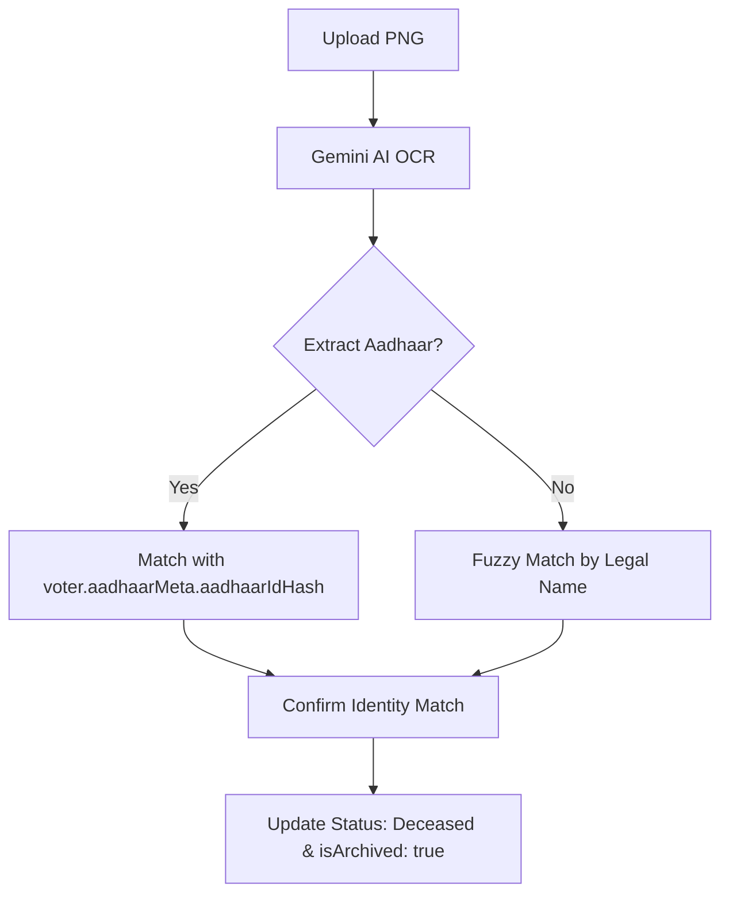

# Death Certificate Test Data (Aadhaar-First Protocol)

## Overview

This directory contains official PNG death certificates for testing the VoteGuard Municipal Upload feature. 

> [!IMPORTANT]
> **Aadhaar-First Security:** The system matches deceased records using the **Aadhaar Number** extracted from the certificate. Voter IDs (EPIC) are secondary and are not required on the certificate for a successful match.

---

## 🛠️ PNG Certificate Generator
Because some test certificates are large or specific to your database state, I have provided a **Local Generator Utility**. 

**To generate the PNGs for Karthik Nair and Sanjay Iyer:**
1. Open [generate_test_images.html](file:///c:/Users/Harini%20Sai%20Haran/Downloads/voteguard%20(1)/test-data/generate_test_images.html) in your browser (Chrome/Edge/Firefox).
2. Click the **"Generate & Download PNGs"** button.
3. Save the resulting files into this `test-data` folder.

---

## 📂 Available Test PNGs

| Certificate | Name | Aadhaar Suffix (Hash Match) | State |
|-------------|------|---------------------------|-------|
| [Certificate 1](file:///c:/Users/Harini%20Sai%20Haran/Downloads/voteguard%20(1)/test-data/death_certificate_ramesh_kumar.png) | RAMESH KUMAR | 2001 | Tamil Nadu |
| [Certificate 2](file:///c:/Users/Harini%20Sai%20Haran/Downloads/voteguard%20(1)/test-data/death_certificate_priya_sharma.png) | PRIYA SHARMA | 2006 | Delhi |

---

## Testing Workflow

### 1. Verification Hub
- Login as **Municipal Officer**.
- Navigate to the **"Civil Registry: Aadhaar Death Verification"** terminal.

### 2. Identity Extraction
- Upload `death_certificate_ramesh_kumar.png`.
- The **Gemini AI** extracts:
  - **Legal Name:** Ramesh Kumar
  - **Aadhaar Number:** XXXX-XXXX-2001
- The system identified the node `HASH-2001` in the National Roll.

### 3. Decommissioning
- Click **"Decommission Identity"**.
- The record is moved to the **Archived** status and removed from the active roll.

---

## Technical Matching Logic

---

## Expected Results

| Field | Found Value |
|-------|-------------|
| **Matching Confidence** | HIGH (IDENTITY VERIFIED) |
| **Logic Anchor** | Aadhaar Link |
| **Final Status** | DECEASED (Archived) |

---

## Troubleshooting

- **Image Quota Error:** If you see "429 Too Many Requests", wait for the quota to reset or manually verify the voter by Aadhaar number.
- **Mismatch:** Ensure the certificate captures the full name and Aadhaar suffix clearly.

---

*Last Updated: 2026-02-01*
